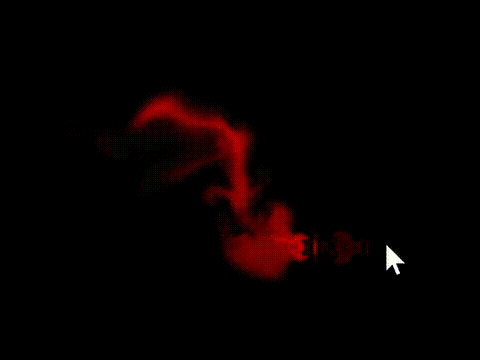
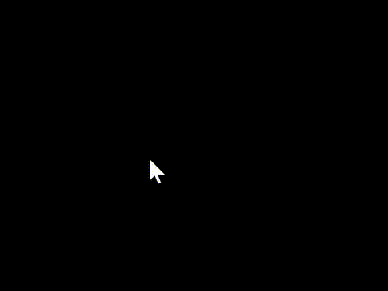

# Java Interactive Fluid Simulation

This is an interactive fluid simulation project based
on [Jos Stam's "Real-Time Fluid Dynamics for Games"](https://www.cs.cmu.edu/afs/cs/academic/class/15462-s13/www/lec_slides/StamFluidforGames.pdf).

The project includes two implementations:

- **CPU Version**: Built using Java Swing framework
- **GPU Version**: Built using **compute shaders** with OpenGL via the [LWJGL](https://www.lwjgl.org/) framework

## 🖼️ Preview
<table>
  <tr>
    <th>Density Render Mode</th>
    <th>Velocity Render Mode</th>
  </tr>
  <tr>
    <td></td>
    <td></td>
  </tr>
</table>
In velocity render mode, the x-component of velocity is mapped to the red channel🟥, and the y-component is mapped to the
green channel🟩. Negative values in either component appear as black.

## 🔧 How To Run & Play?

### Prerequisites

- Java 17 or later (Note: The latest Java versions may not be fully compatible with Gradle.)
- A graphics card that supports OpenGL 4.3 (For GPU version)

### Clone the Repository

```bash
git clone https://github.com/Bowen951209/fluid-simulation.git
cd fluid-simulation
```

### Run using Gradle

```bash
./gradlew run
```

The default entry point is the `App` class (GPU version). To run the Java Swing version, manually change the
`application` block in `build.gradle` file.

```groovy
application {
    mainClassName = 'AppSwing'
}
```

### Controls

- Mouse Drag – Add density and apply impulse to the velocity field
- Press `F1` to use the default density render mode.
- Press `F2` to use the velocity field render mode.
- Press `F3` to clean up all density and velocity fields.

## Some Details

Jos Stam's original paper uses *Gauss-Seidel iteration* to solve for fields. However, that algorithm is not suitable for
GPU applications, so I use *Jacobi iteration* instead. They serve the same purpose and look quite similar, but differ
slightly in how data is updated.

Here's an old [Nvidia GPU Gems chapter](https://developer.nvidia.com/gpugems/gpugems/part-vi-beyond-triangles/chapter-38-fast-fluid-dynamics-simulation-gpu).
Note that the framework used in it is deprecated, and some math notations appear broken, but it's still worth checking out.

The `mothers-day-special` branch includes a fun feature not commonly found in fluid simulations.
You can press `Ctrl + V` to render your clipboard text to the density field. This feature was a surprise for my mom on
Mother's Day — I pasted "Happy Mother's Day" and showed her the result. 💕
